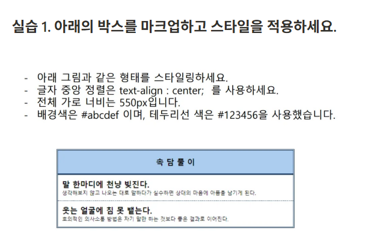

## ✏️ 실습 주제: 박스 모델 이해, 텍스트 스타일 적용

### 🧪 실습 요구사항


### ✅ 내가 작성한 코드
practice1.html
```html
<!DOCTYPE html>
<html lang="ko">
<head>
    <meta charset="UTF-8">
    <meta name="viewport"
          content="width=device-width, user-scalable=no, initial-scale=1.0, maximum-scale=1.0, minimum-scale=1.0">
    <meta http-equiv="X-UA-Compatible" content="ie=edge">
    <title>Title</title>
    <link rel="stylesheet" href="practice1.css">
</head>
<body>
    <section>
        <h1 class="title">속담풀이</h1>
        <div class="content1">
            <h2>말 한마디에 천냥 빚진다.</h2>
            <p>생각해보지 않고 나오는 대로 말하다가
                실수하면 상대의 마음에 아픔을 남기게 된다.</p>
        </div>
        <div class="content2">
            <h2>웃는 얼굴에 침 못 뱉는다.</h2>
            <p>호의적인 의사소통 방법은 자기 말만
                하는 것보다 좋은 결과로 이어진다.</p>
        </div>
    </section>
</body>
</html>
```

practice1.css
```css
@import url("common.css");

section {
    width: 550px;
    border-style: double;
    border-width: 3px;
    border-color: #123456;
    margin: 10px auto;
}
h1.title {
    height: 50px;
    text-align: center;
    line-height: 50px;
    border-bottom: 3px solid;
    background: #abcdef;
    letter-spacing: 6px;
    font-size: 16px;
    font-weight: 600;
}
div.content1 {
    height: 56px;
    border-bottom: 1px dashed #000;
    padding: 12px 0 8px 10px;
}
div.content1 h2 {
    font-size: 16px;
    font-weight: 600;
    text-align: left;
    margin-bottom: 7px;
}

div.content2 {
    height: 56px;
    padding: 12px 0 8px 10px;
}
div.content2 h2 {
    font-size: 16px;
    font-weight: 600;
    text-align: left;
    margin-bottom: 7px;
}
```


### 🔍 피드백 & 정답 코드 비교

* ✅ 좋은 점

  * section의 border를 잘 표현했음
  * letter-spacing을 통해 h1의 자간을 잘 표현함.
  * 두 개의 div 사이 테두리 선을 변경한 건 잘함.

* ❗ 아쉬운 점

  * div 태그를 content1, content2 두 개로 나눴음 → css 작성 과정에서 중복되는 부분 발생
  * section의 border를 표현할 때, 단축 속성으로 지정하면 더 깔끔함 `border: 3px double #123456;`
  * h1의 하단 border를 설정했으나, 테두리 색을 깜빡함
  * 두 개의 div 사이의 border의 속성이 틀림 - dotted #123456으로 했어야 함.


* ✅ 개선된 코드

해답 html
```html
<!DOCTYPE html>
<html lang="ko">
<head>
    <meta charset="UTF-8">
    <meta name="viewport"
          content="width=device-width, user-scalable=no, initial-scale=1.0, maximum-scale=1.0, minimum-scale=1.0">
    <meta http-equiv="X-UA-Compatible" content="ie=edge">
    <title>Title</title>
    <link rel="stylesheet" href="practice1.css">
</head>
<body>
    <section>
        <h1 class="title">속담풀이</h1>
        <div class="content">
            <h2>말 한마디에 천냥 빚진다.</h2>
            <p>생각해보지 않고 나오는 대로 말하다가
                실수하면 상대의 마음에 아픔을 남기게 된다.</p>
        </div>
        <div class="content">
            <h2>웃는 얼굴에 침 못 뱉는다.</h2>
            <p>호의적인 의사소통 방법은 자기 말만
                하는 것보다 좋은 결과로 이어진다.</p>
        </div>
    </section>
</body>
</html>
```

해답 css
```css
@import url("common.css");

section {
    width: 550px;
    border: 3px double #123456;
    margin: 70px auto;
}
section .title {
    background: #abcdef;
    text-align: center;
    font-size: 2.5em;
    font-weight: 700;
    letter-spacing: 10px;
    padding: 15px 0;
    border-bottom: 3px solid #123456;
}
section .content {
    font-size: 1.5em;
    /*border: 4px dashed orange;*/
    padding: 15px 12px;
}
section .content h2 {
    font-size: 1.3em;
    font-weight: 700;
    margin-bottom: 10px;
}
section .content:last-child {

    border-top: 3px dotted #123456;
}
```

---

### 💡 배운 점 정리

* 태그를 나누지 말고 선택자를 고민하면 중복된 부분을 피할 수 있음
* 단축 속성을 이용하면 깔끔한 코딩이 됨
* 테두리 속성을 잘 잊는다는 것을 깨달음
* 점선 속성의 이름은 `dotted`

---

### 🧠 다음에 적용할 것

* 중복된 부분을 줄이는 연습하기
* 박스 레이아웃 꾸밀 때 속성을 꼼꼼하게 살피기
