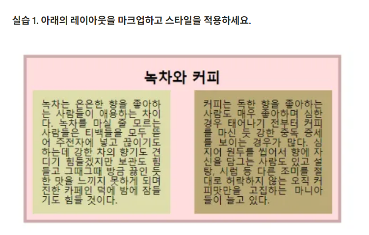

## ✏️ 실습 주제: Flexbox 레이아웃 시스템

### 🧪 실습 요구사항


### ✅ 내가 작성한 코드
practice1.html
```html
<!DOCTYPE html>
<html lang="ko">
<head>
    <meta charset="UTF-8">
    <meta name="viewport"
          content="width=device-width, user-scalable=no, initial-scale=1.0, maximum-scale=1.0, minimum-scale=1.0">
    <meta http-equiv="X-UA-Compatible" content="ie=edge">
    <title>Title</title>
    <link rel="stylesheet" href="../5-box-model/common.css">
    <style>
        .container {
            width: 80%;
            height: 500px;
            background: #efd3d7;
            padding: 18px;
            margin: 20px auto;
            border: 6px solid #c08484;
            display: flex;
            flex-wrap: wrap;
        }
        .main_title {
            font-size: 40px;
            font-weight: bold;
            text-align: center;
            margin: 20px auto;
            /*background: red;*/
        }
        .bottom {
            /*background: green;*/
            display: flex;
            justify-content: space-between;
        }
        section div p {
            width: 45%;
            padding: 15px;
            font-size: 31px;
        }
        .green {
            background: #eef59a;
        }
        .coffee{
            background: #B39B7B;
        }
    </style>
</head>
<body>
    <section class="container">
        <h1 class="main_title">녹차와 커피</h1>
        <div class="bottom">
            <p class="green">
                녹차는 은은한 향을 좋아하는 사람들이 애용하는 차이다. 녹차를 마실 줄 모르는 사람들은
                티백들을 모두 뜯어 주전자에 넣고 끊이기도 하는데 강한 차의 향기도 견디기 힘들겠지만
                보관도 힘들고 그때그때 방금 끓인 듯한 맛을 느끼지 못하게 되며 진한 카페인 덕에 밤에
                잠들기도 힘들 것이다.
            </p>
            <p class="coffee">
                커피는 독한 향을 좋아하는 사람도 매우 좋아하며 심한 경우 태어나기 전부터 커피를 마신
                듯 강한 중독 증세를 보이는 경우가 많다. 심지어 원두를 씹어서 향에 자신을 담그는 사람도
                있고 설탕, 시럽 등 다른 조미를 절대로 허락하지 않는 오직 커피맛만을 고집하는 마니아들
                이 늘고 있다.
            </p>
        </div>
    </section>
</body>
</html>
```


### 🔍 피드백 & 정답 코드 비교

* ✅ 좋은 점

  * section의 레이아웃을 잘 적용했음.

* ❗ 아쉬운 점

  * `height: 500px;`는 내용이 넘칠 경우 잘림 → 높이 지정 없이 padding 만으로 구성
  * .container에 `flex-wrap: wrap;`을 주었지만 h1 태그는 블록 요소이기 때문에 한 줄을 차지하므로 현재 구조에서는 실질적인 wrap 효과는 나타나지 않음 → .cpntainer에서 flex 관련 요소를 제거거
  * section div p 와 같은 선택자를 사용하면 범용적이라 구조가 바뀌면 의도치 않게 스타일이 적용될 수 있음 → 클래스명 기반 선택자 사용
  * p 태그의 텍스트가 justify 정렬이 아니어서 정렬이 고르지 않음 → `text-align: justify;` 추가가


* ✅ 개선된 코드

해답 html
```html
<!DOCTYPE html>
<html lang="ko">
<head>
    <meta charset="UTF-8">
    <meta name="viewport"
          content="width=device-width, user-scalable=no, initial-scale=1.0, maximum-scale=1.0, minimum-scale=1.0">
    <meta http-equiv="X-UA-Compatible" content="ie=edge">
    <title>Title</title>
    <link rel="stylesheet" href="../5-box-model/common.css">
    <style>
        .container {
            width: 40%;
            background: pink;
            margin: 50px auto;
            border: 5px solid #caa;
            padding: 20px;
        }
        .container .main-title {
            font-size: 1.5em;
            font-weight: 700;
            text-align: center;
            margin-bottom: 20px;
        }
        .container .bottom {
            /*border: 3px solid red;*/
            display: flex;
            justify-content: space-between;
        }
        .container .bottom p {
            /*border: 3px dashed green;*/
            width: 45%;
            padding: 15px;
            line-height: 1.4;
            font-size: 1.2em;
            text-indent: 7px;
            text-align: justify;
        }
        .container .bottom .green {
            background: #dda;
        }
        .container .bottom .coffee {
            background: #ba7;
        }

    </style>
</head>
<body>
    <!--    section.container>h1.main-title+(div.bottom>p.green+p.coffee)-->
    <section class="container">
        <h1 class="main-title">녹차와 커피</h1>
        <div class="bottom">
            <p class="green">
                녹차는 은은한 향을 좋아하는 사람들이 애용하는 차이다. 녹차를 마실 줄 모르는 사람들은
                티백들을 모두 뜯어 주전자에 넣고 끊이기도 하는데 강한 차의 향기도 견디기 힘들겠지만
                보관도 힘들고 그때그때 방금 끓인 듯한 맛을 느끼지 못하게 되며 진한 카페인 덕에 밤에
                잠들기도 힘들 것이다.
            </p>
            <p class="coffee">
                커피는 독한 향을 좋아하는 사람도 매우 좋아하며 심한 경우 태어나기 전부터 커피를 마신
                듯 강한 중독 증세를 보이는 경우가 많다. 심지어 원두를 씹어서 향에 자신을 담그는 사람도
                있고 설탕, 시럽 등 다른 조미를 절대로 허락하지 않는 오직 커피맛만을 고집하는 마니아들
                이 늘고 있다.
            </p>
        </div>
    </section>
</body>
</html>
```

---

### 💡 배운 점 정리

* height를 지정해 놓으면 내용이 넘칠 경우 잘림
* h1 태그가 블록 요소임을 명심
* 클래스명 기반 선택자를 사용해야 스타일 적용 오류를 막을 수 있음
* em 단위를 쓰면 반응형 환경에서도 잘 어울림
* 텍스트를 양쪽 정렬하려면 justify

---

### 🧠 다음에 적용할 것

* height 속성을 잘 이용하는 연습
* 클래스명 기반 선택자 사용
* 텍스트 속성에 대해 살펴보기

