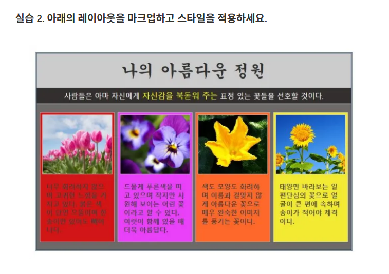

## ✏️ 실습 주제: Flexbox 레이아웃 시스템2

### 🧪 실습 요구사항


### ✅ 내가 작성한 코드
practice2.html
```html
<!DOCTYPE html>
<html lang="ko">
<head>
    <meta charset="UTF-8">
    <meta name="viewport"
          content="width=device-width, user-scalable=no, initial-scale=1.0, maximum-scale=1.0, minimum-scale=1.0">
    <meta http-equiv="X-UA-Compatible" content="ie=edge">
    <title>Title</title>
    <link rel="stylesheet" href="../5-box-model/common.css">
    <style>
        .container {
            width: 50%;
            /*background: pink;*/
            margin: 20px auto;
            border: 3px double #476d7a;
        }
        .main_title {
            background: #c4c2c2;
            text-align: center;
            font-size: 40px;
            font-weight: bold;
            height: 80px;
            padding: 20px 0;
        }
        .sub_title {
            background: #000;
            color: #fff;
            text-align: center;
            font-size: 20px;
            height: 40px;
            padding: 10px 0;
        }
        .sub_title span {
            color: yellow;
        }
        .bottom {
            background: grey;
            display: flex;
            justify-content: space-between;
            padding: 20px 10px;
        }
        .bottom li {
            margin-right: 10px;
            padding: 10px;
            width: 24%;
        }
        .bottom li .image {
            background: skyblue;
            height: 100px;
            margin-bottom: 20px;
            overflow: hidden;
        }
        .bottom li .image img {
            width: 100%;
            height: 100%;
        }
        .bottom li:last-child{
            margin-right: 0;
        }
        .bottom .frame1 {
            background: red;
        }
        .bottom .frame2 {
            background: deeppink;
        }
        .bottom .frame3 {
            background: orange;
        }
        .bottom .frame4 {
            background: yellow;
        }
    </style>
</head>
<body>
    <section class="container">
        <h1 class="main_title">나의 아름다운 정원</h1>
        <h2 class="sub_title">
            사람들은 아마 자신에게
            <span>자신감을 북돋워 주는</span>
            표정 있는 꽃들을 선호할 것이다.
        </h2>
        <ul class="bottom">
            <li class="frame1">
                <div class="image"></div>
                <p>
                    너무 화려하지 않으며 고귀한 느낌을 가지고 있다.
                    붉은 색이 단연 으뜸이며 한 송이만 있어도 빼어나다.
                </p>
            </li>
            <li class="frame2">
                <div class="image"></div>
                <p>
                    드물게 푸른색을 띠고 있으며 작지만 시원해 보이는
                    어린 꽃이라고 할 수 있다. 여럿이 함께 있을 때 더욱 아름답다.
                </p>
            </li>
            <li class="frame3">
                <div class="image"></div>
                <p>
                    색도 모양도 화려하며 이름과 걸맞지 않게 아름다운 꽃으로
                    매우 완숙한 이미지를 풍기는 꽃이다.
                </p>
            </li>
            <li class="frame4">
                <div class="image"></div>
                <p>
                    태양만 바라보는 일편단심의 꽃으로 얼굴이 큰 편에
                    속하며 송이가 적어야 제격이다.
                </p>
            </li>
        </ul>
    </section>

</body>
</html>
```


### 🔍 피드백 & 정답 코드 비교

* ✅ 좋은 점

  * container, main_title, sub_title, bottom 등 의미 있는 class 명을 사용해서 구조가 깔끔하게 짜여 있음
  * .bottom에 display: flex와 justify-content: space-between을 사용해서 아이템을 가로로 배치했음
  * 각 li에 frame1, frame2 등 고유 스타일을 줄 수 있도록 클래스 네이밍을 잘 했음음

* ❗ 아쉬운 점

  * 각 li에 margin-right를 직접 주고, 마지막 li만 따로 margin-right: 0을 줌 관리하기 어려운 패턴이 됨 → `space-evenly`를 쓰면 양 끝 간격 포함해서 자동 정렬이 되므로 깔끔해짐
  * .image에 overflow: hidden;을 했기 때문에 img 태그에 height: 100%만 줘도 밖으로 이미지들이 튀어나오지 않음 → width: 100% 제거
  * 메인 타이틀과 서브 타이틀은 height를 적용했기 때문에 내용이 넘칠 경우 잘림 → 높이 지정 없이 padding 만으로 구성
  * 이미지 밑에 있는 p 태그의 폰트 속성 설정이 필요


* ✅ 개선된 코드

해답 html
```html
<!DOCTYPE html>
<html lang="ko">
<head>
    <meta charset="UTF-8">
    <meta name="viewport"
          content="width=device-width, user-scalable=no, initial-scale=1.0, maximum-scale=1.0, minimum-scale=1.0">
    <meta http-equiv="X-UA-Compatible" content="ie=edge">
    <title>Title</title>
    <link rel="stylesheet" href="../5-box-model/common.css">
    <style>
        img {
            /*display: none;*/
            /*opacity: 0.6;*/
        }

        .container {
            width: 60%;
            border: 3px double #123456;
            margin: 50px auto;
        }
        .container .main-title {
            background: #ccc;
            font-size: 3em;
            font-weight: 700;
            text-align: center;
            padding: 20px 0;
            font-family: "궁서체", cursive;
        }
        .container .sub-title {
            font-size: 1.2em;
            background: #333;
            color: #fff;
            text-align: center;
            padding: 10px 0;
            border-bottom: 2px solid #ccc;
        }
        .container .sub-title .yellow {
            font-size: 1.1em;
            color: #ff0;
        }
        .container .gallery {
            background: #6a6a6a;
            padding: 20px 0;
            display: flex;
            justify-content: space-evenly;
        }
        .container .gallery li {
            background: #fff;
            /*border: 2px solid red;*/
            width: 24%;
            height: 40rem;
            padding: 7px;
        }
        .container .gallery li .img-box {
            height: 50%;
            background: violet;
            border: 1px solid #000;
            margin-bottom: 20px;
            overflow: hidden;
        }
        .container .gallery li .img-box img {
            height: 100%;
        }

        .container .gallery li p {
            font-size: 1.2em;
            font-weight: 700;
            padding: 10px;
            line-height: 1.4;
            text-align: justify;
            color: #333;
        }
        .container .gallery .tulip {
            background: #d31515;
        }
        .container .gallery .jebi {
            background: #e941f9;
        }
        .container .gallery .hobak {
            background: #f2692b;
        }
        .container .gallery .sunflower {
            background: #f3ea33;
        }

    </style>
</head>
<body>

    <section class="container">
        <h1 class="main-title">나의 아름다운 정원</h1>
        <h2 class="sub-title">
            사람들은 아마 자신에게
            <span class="yellow">자신감을 북돋워 주는</span>
            표정 있는 꽃들을 선호할 것이다.
        </h2>
        <ul class="gallery">
            <li class="tulip">
                <div class="img-box">
                    
                </div>
                <p>
                    너무 화려하지 않으며 고귀한 느낌을 가지고 있다.
                    붉은 색이 단연 으뜸이며 한 송이만 있어도 빼어나다.
                </p>
            </li>

            <li class="jebi">
                <div class="img-box">
                    
                </div>
                <p>
                    드물게 푸른색을 띠고 있으며 작지만 시원해 보이는
                    어린 꽃이라고 할 수 있다. 여럿이 함께 있을 때 더욱 아름답다.
            </li>
            <li class="hobak">
                <div class="img-box">
                    
                </div>
                <p>
                    색도 모양도 화려하며 이름과 걸맞지 않게 아름다운 꽃으로
                    매우 완숙한 이미지를 풍기는 꽃이다.
                </p>
            </li>
            <li class="sunflower">
                <div class="img-box">
                    
                </div>
                <p>
                    태양만 바라보는 일편단심의 꽃으로 얼굴이 큰 편에
                    속하며 송이가 적어야 제격이다.
                </p>
            </li>
        </ul>
    </section>
</body>
</html>
```

---

### 💡 배운 점 정리

* `space-evenly`를 이용하면 양 끝 간격 포함해서 자동 정렬이 됨
* 이미지의 부모 태그에 `overflow: hidden;`을 적용했기 때문에 `height: 100%` 혹은 `width: 100%` 둘 중에 한 가지만 사용해도 깔끔한 이미지 레이아웃을 만들 수 있음
* height 속성 사용으로인한 잘림 현상에 대해 학습

---

### 🧠 다음에 적용할 것

* `space-evenly` 활용하기
* height 속성을 잘 이용하는 연습
* 폰트 속성 설정하기
