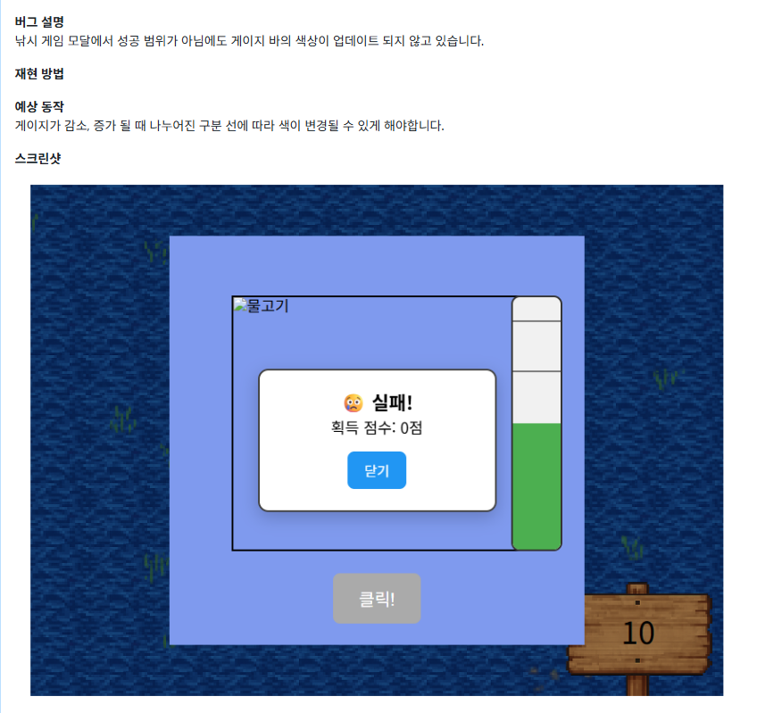
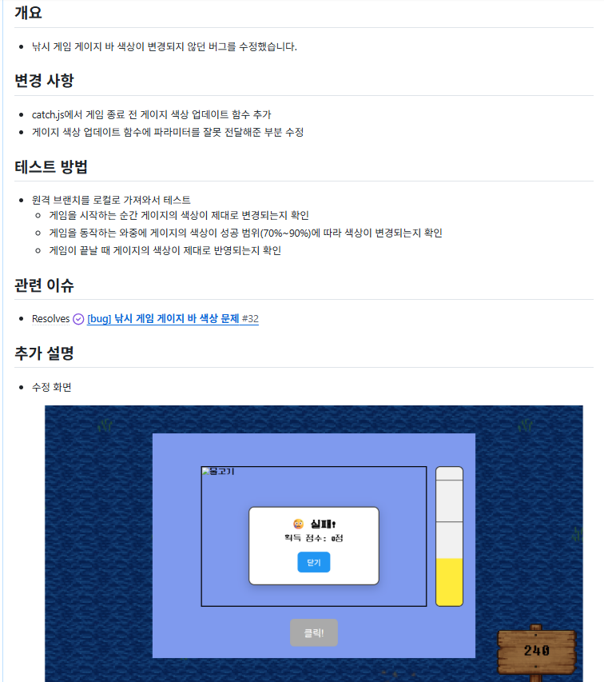

실제 깃허브 활용 예시

문제 인식: 낚시 게임 진행 중 성공 범위가 아님에도 게이지 바의 색상이 업데이트 되지 않는 문제 발생

깃허브에서 Issues 생성

[bug] 낚시 게임 게이지 바 색상 문제 #32

# develop 브랜치에서 새 브랜치 생성 및 이동
git checkout develop
git pull origin develop
git branch bug/32-fishingGauge-kgj
git switch bug/32-fishingGauge-kgj

# 작업 후 커밋
git add .
git commit -m "fix: 게임 종료 시 게이지 업데이트, updateGaugeColor 파라미터 부족 해결"

# 원격 저장소로 push
git push origin bug/32-fishingGauge-kgj

# Pull Request 요청
Bug: #32 낚시 게임 게이지 바 색상 문제 #33

테스트
# 원격 브랜치를 로컬로 가져옴
git fetch origin bug/32-fishingGauge-kgj
git switch bug/32-fishingGauge-kgj

Pull Request 에서 변경된 내용을 사용자의 이용 시나리오에 맞춰 Case를 나눠서 확인
- 게임을 시작하는 순간 게이지의 색상이 제대로 변경되는지 확인
- 게임을 동작하는 와중에 게이지의 색상이 성공 범위(70%~90%)에 따라 색상이 변경되는지 확인
- 게임이 끝날 때 게이지의 색상이 제대로 반영되는지 확인

# 테스트 완료 후 문제가 없으면 코멘트 작성 후 develop 브랜치에 Merge

# Merge 후 브랜치 정리
git switch develop
git pull origin develop
git branch -d bug/32-fishingGauge-kgj
git push origin --delete bug/32-fishingGauge-kgj

