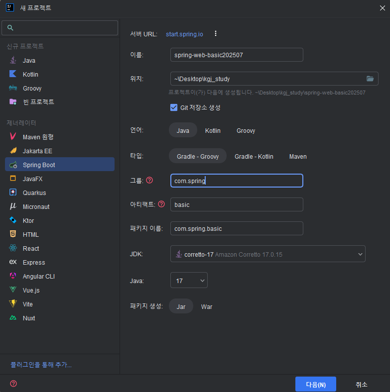

# 🗓️ 2025년 7월 11일 TIL

## ✅ 오늘의 핵심 키워드

* Maven
* MVC 아키텍처
* Spring Boot 설정
* Spring Controller
* Redirect vs Forward

---

## 📦 Maven이란?

* **Maven**은 Java 프로젝트에서 필요한 **라이브러리를 자동으로 다운로드**하고 **빌드 및 의존성 관리를 쉽게 해주는 도구**
* Gradle과 함께 가장 많이 쓰이는 빌드 도구 중 하나

---

## 🧱 MVC 아키텍처

### ❗MVC 필요한 이유

* 기존에는 서블릿(Servlet)이 \*\*모든 역할(요청 처리, 데이터 처리, 뷰 렌더링 등)\*\*을 혼자 다 해결
* ➡️ 이것은 OOP의 \*\*단일 책임 원칙(SRP)\*\*을 위반한 구조

* 그래서 각 역할을 나눠 모듈화한 구조가 바로 **MVC(Model-View-Controller)** 패턴

---

### 📌 MVC 구성 요소

| 구성 요소          | 설명                               |
| -------------- | -------------------------------- |
| **Model**      | 비즈니스 로직 처리, DB 연동 등 데이터 처리       |
| **View**       | 사용자에게 보여지는 화면 (JSP, Thymeleaf 등) |
| **Controller** | 사용자 요청 처리, Model과 View 연결 역할     |

---

### 📈 MVC 동작 흐름

1. 사용자가 URL로 요청을 보냄
2. `DispatcherServlet`이 요청을 받아 알맞은 `Controller`로 전달
3. `Controller`가 비즈니스 로직(Model)과 통신
4. 처리된 데이터를 View에 전달하고, 사용자에게 결과 응답

---

### 🔒 보안상 JSP 마스킹 처리

* URL에 실제 JSP 경로가 노출되면 보안상 위험함
* `WEB-INF` 폴더 안에 JSP를 넣으면 브라우저에서 직접 접근할 수 없음
* 대신 **서블릿을 통해서만 접근 가능**

```java
@WebServlet("/mvc/v1/new")
public class AddNewDancerServlet extends HttpServlet {

    @Override
    protected void service(HttpServletRequest req, HttpServletResponse resp)
            throws ServletException, IOException {

        // JSP 파일을 찾아서 View를 보여줌 (뷰 포워딩)
        RequestDispatcher dp = req.getRequestDispatcher("/WEB-INF/chap04/dancer/dancer-register.jsp");
        dp.forward(req, resp);
    }
}
```

---

## 🔁 Redirect vs Forward

| 구분           | 특징                                                 |
| ------------ | -------------------------------------------------- |
| **Redirect** | 클라이언트에게 새 요청을 보내게 함 (주소창 URL 변경됨), 예: 삭제 후 목록으로 이동 |
| **Forward**  | 서버 내부에서 해당 뷰만 보여줌 (URL 변경 없음), 예: 등록 폼 띄우기 등       |

---

## 🌱 스프링 프레임워크 소개

### 📦 Spring의 구성

* **다양한 모듈**(웹, 데이터, 시큐리티 등)로 구성된 프레임워크
* 웹 애플리케이션을 빠르게 개발할 수 있도록 도와줌

---

### 📁 Spring 프로젝트 생성

* [https://start.spring.io](https://start.spring.io) 에서 생성
* Project: Gradle - Groovy
* Language: Java
* Spring Boot: `3.4.7`
* Group: 보통 회사의 도메인을 씀, 이번에는 com.spring
* Artifact: 프로젝트 이름 (basic)
* Name: 폴더 이름
* Package name: 루트
* Packaging: Jar
* Java Version: `17`
* 필요한 모듈: `Lombok`, `Spring Web`, `Spring Boot DevTools`

---
* 인텔리제이 스프링 세팅
* 
---
**application.properties**

* 핵심 설정 파일
* 실제 운영 환경에서는 **Git에 올리면 안 됨!**

**build.gradle**

* 라이브러리 의존성 관리
* 추가 시 [Maven Repository](https://mvnrepository.com)에서 코드를 복사해서 `dependencies`에 붙여넣음

---

## 🎮 스프링 컨트롤러 기본 사용법

### 🔹 @Controller vs @RestController

| 애노테이션             | 설명                                 |
| ----------------- | ---------------------------------- |
| `@Controller`     | JSP와 같은 View 반환용                   |
| `@RestController` | JSON 응답용 (`@ResponseBody` 내장되어 있음) |

---

### HelloController 예시

```java
@Controller
public class HelloController {

    @RequestMapping("/chap01/hello")
    @ResponseBody
    public Map<String, Object> hello() {
        return Map.of("name", "김철수", "age", 50);
    }

    @RequestMapping("/chap01/bye")
    public String bye() {
        // bye.jsp를 열어줌 (뷰 포워딩)
        return "bye";
    }
}
```

✅ `@ResponseBody`가 있으면 JSON 리턴, 없으면 JSP 뷰를 찾음
✅ return "bye"는 `/WEB-INF/views/bye.jsp`를 열어주는 것으로 매핑됩니다 (view resolver 설정에 따라)

---

### BasicController 예시

```java
@RestController
@RequestMapping("/chap2-2")
public class BasicController {

    @GetMapping("/hello")
    public String hello() {
        return "hello spring";
    }

    @PostMapping("/hobby")
    public List<String> hobby() {
        return List.of("수영", "축구", "낮잠", "시비걸기");
    }
}
```

✔ `@RestController`는 기본적으로 JSON 응답
✔ `@GetMapping`, `@PostMapping`으로 메서드 구분

---

### ProductController 예시

```java
@RestController
@RequestMapping("/products")
public class ProductController {

    private Map<Long, Product> productMap = new HashMap<>();
    private long nextId = 1;

    public ProductController() {
        productMap.put(nextId++, new Product(nextId, "에어컨", 1000000));
        productMap.put(nextId++, new Product(nextId, "세탁기", 1500000));
        productMap.put(nextId++, new Product(nextId, "공기청정기", 300000));
    }

    @GetMapping
    public Product getProduct(
        @RequestParam("id") long id,
        @RequestParam(value = "price", required = false, defaultValue = "1000") int price
    ) {
        return productMap.get(id);
    }
}
```

✅ `@RequestParam`은 쿼리스트링 파라미터를 자동으로 매핑해줌
✅ `required = false`로 선택적 파라미터 처리 가능, 기본값도 설정 가능

---

## 🧠 오늘의 요약

* **MVC 패턴**은 역할 분리를 통해 유지보수성과 확장성을 높임
* **Servlet → JSP 구조**의 문제점을 개선하기 위해 등장
* **Spring**은 이 MVC 구조를 손쉽게 구현할 수 있도록 도와주는 강력한 프레임워크
* 컨트롤러를 만들 땐 `@Controller`, `@RestController`를 상황에 맞게 사용
* **포워딩**과 **리다이렉트**의 차이는 실제 서비스에서 매우 중요!
