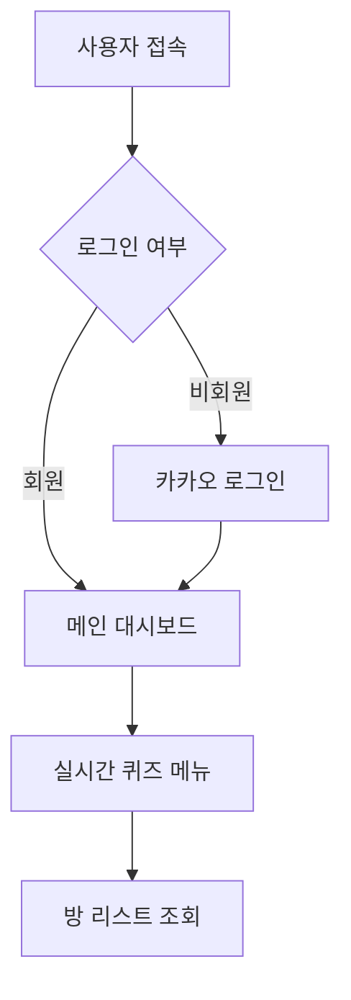

# 🗓️ 2025년 9월 5일 TIL - Windsurf 바이브 코딩

## 📌 오늘의 키워드
`Windsurf` `바이브 코딩` `Vibe Coding` `AI 코드 에디터` `Cascade` `Flow` `프로젝트 문서 설계` `자연어 프로그래밍`

---

## 🌊 Windsurf란?
- Codeium에서 개발한 AI 기반 코드 에디터로, "세계 최초의 에이전틱 IDE(Agentic IDE)"를 표방

### 주요 특징
- **AI 네이티브 IDE**: 처음부터 AI와의 협업을 위해 설계된 에디터
- **VSCode 기반**: VSCode의 익숙한 인터페이스와 확장성 제공
- **무료 사용 가능**: 기본 기능은 무료로 사용 가능 (Pro 플랜도 존재)
- **실시간 컨텍스트 인식**: 프로젝트 전체를 이해하고 코드 생성

### 다른 AI 도구와의 차이점
- **GitHub Copilot**: 코드 자동완성에 특화
- **Cursor**: AI 채팅 + 코드 편집
- **Windsurf**: AI 에이전트가 파일을 읽고, 생성하고, 수정하는 "에이전틱" 접근

---

## 🎵 바이브 코딩(Vibe Coding)이란?

**바이브 코딩**은 개발자가 코드의 세세한 구현보다 **"무엇을 만들고 싶은지"**에 집중하고, 
AI가 그 의도를 파악하여 실제 코드를 생성하는 개발 방식

### 바이브 코딩의 핵심
```
전통적 코딩: 개발자가 직접 모든 코드를 작성
    ↓
페어 프로그래밍: 두 명의 개발자가 협업
    ↓
AI 코파일럿: AI가 코드 자동완성 제안
    ↓
바이브 코딩: 개발자는 의도만 전달, AI가 전체 구현
```

### 바이브 코딩의 장점
- **빠른 프로토타이핑**: 아이디어를 빠르게 코드로 구현
- **본질에 집중**: 구현 디테일보다 비즈니스 로직에 집중
- **반복 작업 자동화**: 보일러플레이트 코드 자동 생성
- **학습 도구**: AI가 생성한 코드를 보며 학습 가능

---

## 🚀 Windsurf로 바이브 코딩하는 방법

### 1. 설치 및 초기 설정

**설치**
```bash
# Windsurf 공식 웹사이트에서 다운로드
# https://codeium.com/windsurf

# Windows, macOS, Linux 지원
```

**초기 설정**
1. Codeium 계정 생성/로그인
2. 프로젝트 폴더 열기
3. AI 모델 선택 (Claude, GPT-4 등)

---

### 2. Cascade: AI 에이전트 모드

**Cascade**는 Windsurf의 핵심 기능으로, AI가 능동적으로 파일을 생성하고 수정함

#### Cascade 실행 방법
```
단축키: Cmd/Ctrl + L (Cascade 채팅 열기)
```

#### Cascade의 작동 방식
1. **컨텍스트 수집**: 프로젝트의 파일 구조, 코드, 문서 자동 분석
2. **계획 수립**: 작업을 여러 단계로 나누어 계획
3. **실행**: 파일 생성, 수정, 삭제 등 실제 작업 수행
4. **검토**: 개발자에게 변경사항 확인 요청

#### Cascade 사용 시나리오
```
✅ 프로젝트 초기 구조 생성
✅ 여러 파일에 걸친 기능 구현
✅ 리팩토링 작업
✅ 테스트 코드 생성
✅ 문서 작성
```

---

### 3. Flow: 실시간 코드 제안

**Flow**는 코딩하는 동안 실시간으로 다음 코드를 제안하는 기능

#### Flow 특징
- **멀티라인 완성**: 한 번에 여러 줄의 코드 제안
- **컨텍스트 인식**: 현재 파일뿐만 아니라 프로젝트 전체 이해
- **빠른 수락**: Tab 키로 제안 수락

#### Flow 활용 팁
```javascript
// 1. 주석으로 의도 명시
// 사용자 인증 미들웨어 생성
// → AI가 전체 함수 생성

// 2. 함수명/변수명으로 의도 전달
function validateUserAuthentication
// → AI가 함수 본문 생성

// 3. 일부만 작성하고 대기
const users = data.filter(
// → AI가 필터 조건 자동 완성
```

---

### 4. Chat: AI와 대화하며 코딩

**Chat**은 Cascade보다 가벼운 대화형 인터페이스

#### Chat vs Cascade
| 기능 | Chat | Cascade |
|------|------|---------|
| 파일 수정 권한 | 없음 | 있음 |
| 사용 시기 | 질문, 설명, 조언 | 실제 코드 생성/수정 |
| 응답 속도 | 빠름 | 느림 (계획 수립) |

#### Chat 활용 사례
```
💬 "이 에러 메시지의 원인이 뭐야?"
💬 "더 나은 알고리즘이 있을까?"
💬 "이 코드를 설명해줘"
💬 "테스트 케이스를 제안해줘"
```

---

## 📝 프로젝트 문서 설계에 Windsurf 활용하기

### 1. README 작성

**프롬프트 예시**
```
Cascade에게 요청:
"SignBell 프로젝트의 README.md를 작성해줘. 
프로젝트는 AI 기반 수어 학습 플랫폼이야.
다음 내용을 포함해줘:
- 프로젝트 소개
- 주요 기능
- 기술 스택
- 설치 방법
- 팀원 정보"
```

**결과**
→ Cascade가 README.md 파일을 생성하고 마크다운 형식으로 작성

---

### 2. 기능 요구사항 명세서 작성

**프롬프트 예시**
```
"프로젝트의 기능 요구사항 명세서를 작성해줘.
MoSCoW 우선순위를 사용하고,
각 기능마다 ID, 설명, 우선순위, 비고를 표 형식으로 정리해줘."
```

**팁**
- 기존 문서가 있다면 파일을 열어두고 참고하도록 요청
- 여러 섹션으로 나누어 단계적으로 작성 요청
- 표 형식이 필요하면 명시적으로 요청

---

### 3. 사용자 흐름도 작성 (Mermaid)

**프롬프트 예시**
```
"로그인부터 퀴즈 방 입장까지의 사용자 흐름도를
Mermaid flowchart 형식으로 작성해줘."
```

**생성 예시**


---

### 4. API 명세서 초안 작성

**프롬프트 예시**
```
"사용자 인증 관련 REST API 명세서를 작성해줘.
다음 엔드포인트를 포함해줘:
- 카카오 로그인
- 로그아웃
- 토큰 갱신
각 API마다 Method, URL, Request, Response 형식으로 작성해줘."
```

---

### 5. 폴더 구조 설계

**프롬프트 예시**
```
"Spring Boot 백엔드 프로젝트의 표준 폴더 구조를 생성해줘.
controller, service, repository, entity, dto, config, exception 패키지를 포함하고,
각 폴더에 .gitkeep 파일을 추가해줘."
```

**결과**
→ Cascade가 실제로 폴더와 파일을 생성

---

## 💡 효과적인 바이브 코딩 팁

### 1. 명확하고 구체적인 프롬프트 작성

**❌ 나쁜 예시**
```
"코드 만들어줘"
```

**✅ 좋은 예시**
```
"Spring Boot에서 JWT 인증 필터를 만들어줘.
- OncePerRequestFilter를 상속
- Authorization 헤더에서 토큰 추출
- 유효하지 않으면 401 반환
- 유효하면 SecurityContext에 인증 정보 저장"
```

---

### 2. 컨텍스트 제공하기

**파일 참조**
```
"@파일명 이 파일을 참고해서 비슷한 스타일로 작성해줘"
```

**폴더 전체 참조**
```
"@폴더명/ 이 폴더 구조를 분석하고, 같은 패턴으로 새로운 기능을 만들어줘"
```

**특정 코드 블록 참조**
```
코드 블록을 선택하고 Cmd/Ctrl + L
"이 코드를 설명해주고, 개선점을 제안해줘"
```

---

### 3. 단계별로 나누어 요청

**한 번에 모든 것 요청 (비추천)**
```
"전체 프로젝트를 만들어줘"
```

**단계별 요청 (추천)**
```
1단계: "기본 프로젝트 구조를 만들어줘"
2단계: "User 엔티티와 Repository를 만들어줘"
3단계: "사용자 인증 서비스를 구현해줘"
4단계: "인증 관련 컨트롤러와 DTO를 만들어줘"
```

---

### 4. 검토하고 피드백하기

**AI가 생성한 코드 검토**
```
✅ 로직이 맞는지 확인
✅ 보안 취약점은 없는지 확인
✅ 프로젝트 컨벤션에 맞는지 확인
✅ 테스트가 필요한 부분 확인
```

**피드백 제공**
```
"좋은데, 에러 핸들링을 추가해줘"
"변수명을 camelCase로 바꿔줘"
"주석을 더 상세하게 추가해줘"
```

---

### 5. 반복 작업 자동화

**반복되는 패턴**
```
"User 엔티티처럼 Product 엔티티를 만들어줘"
"UserController처럼 ProductController를 만들어줘"
```

**CRUD 보일러플레이트**
```
"Word 엔티티에 대한 CRUD API를 전부 만들어줘.
Controller, Service, Repository, DTO 모두 포함해줘."
```

---

## 🎯 바이브 코딩 워크플로우

### 1단계: 프로젝트 계획
```
Cascade에게 요청:
"이 프로젝트의 주요 기능을 분석하고,
개발 우선순위를 제안해줘."
```

### 2단계: 문서 작성
```
"기능 요구사항 명세서를 작성해줘"
"데이터베이스 스키마를 ERD로 그려줘"
"API 명세서를 작성해줘"
```

### 3단계: 구조 생성
```
"프로젝트 폴더 구조를 만들어줘"
"설정 파일들을 생성해줘"
"공통 클래스들을 만들어줘"
```

### 4단계: 기능 구현
```
"User 인증 기능을 구현해줘"
"퀴즈 방 생성 기능을 구현해줘"
"WebRTC 시그널링 서버를 구현해줘"
```

### 5단계: 테스트 & 리팩토링
```
"이 클래스의 단위 테스트를 작성해줘"
"이 코드를 리팩토링해서 가독성을 높여줘"
"성능을 개선할 수 있는 방법을 제안해줘"
```

---

## ⚠️ 주의사항

### 1. AI는 완벽하지 않다
- 생성된 코드를 항상 검토해야 함
- 특히 보안 관련 코드는 더욱 신중하게 확인
- 비즈니스 로직의 정확성은 개발자가 보증해야 함

### 2. 컨텍스트 한계
- 매우 큰 프로젝트는 모든 파일을 인식하지 못할 수 있음
- 필요한 파일만 명시적으로 참조하기

### 3. 프롬프트 엔지니어링 스킬 필요
- 좋은 결과를 얻으려면 좋은 질문이 필요
- 명확하고 구체적인 요청이 중요

### 4. 학습 곡선
- Cascade, Flow, Chat을 언제 사용할지 익혀야 함
- 효과적인 프롬프트 작성법을 연습해야 함

---

## 🔑 핵심 단축키

| 기능 | Windows/Linux | macOS |
|------|---------------|-------|
| Cascade 열기 | Ctrl + L | Cmd + L |
| Flow 토글 | Ctrl + Shift + I | Cmd + Shift + I |
| 제안 수락 | Tab | Tab |
| 제안 거부 | Esc | Esc |
| 다음 제안 | Alt + ] | Option + ] |

---

## 🎯 최종 정리

### 바이브 코딩의 핵심
Windsurf를 활용한 바이브 코딩은 **"무엇을 만들지"**에 집중하고, **"어떻게 만들지"**는 AI와 협업하는 새로운 개발 방식입니다.

### Windsurf의 3대 핵심 기능
1. **Cascade**: 파일을 생성하고 수정하는 AI 에이전트
2. **Flow**: 실시간 코드 자동완성
3. **Chat**: AI와 대화하며 문제 해결

### 효과적인 바이브 코딩을 위한 3가지 원칙
1. **명확하고 구체적인 프롬프트**: AI에게 정확한 의도 전달
2. **단계별 접근**: 큰 작업을 작은 단계로 나누기
3. **검토와 피드백**: AI 결과를 검증하고 개선하기

### 바이브 코딩이 빛나는 순간
- ⚡ 프로젝트 초기 구조 설계 및 보일러플레이트 생성
- 📝 문서 작성 (README, API 명세서, 사용자 흐름도)
- 🔄 반복적인 CRUD 기능 구현
- 🧪 테스트 코드 생성
- 🛠️ 리팩토링 작업

### 앞으로의 학습 방향
- Windsurf의 고급 기능 활용 (Rules, Commands)
- 프로젝트별 최적의 프롬프트 패턴 개발
- AI와 협업하는 새로운 개발 문화 정착

**바이브 코딩은 개발자를 대체하는 것이 아니라, 개발자가 더 높은 수준의 문제 해결에 집중할 수 있게 도와주는 도구입니다.** 🚀

