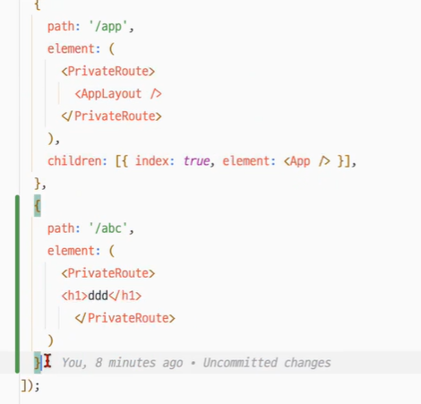

# 🗓️ 2025년 9월 12일 TIL


프라이빗 라우트 컴포넌트 (라우트 가드)

로더를 사용해서 라우트 가드를 할 때에는 로딩중입니다. 등의 ui를 보여줄 수 없었음
컴포넌트로 라우트가드를 하면 가능


```jsx
const PrivateRoute = ({ children }) => {
  const { isAuthenticated, loading, hasCheckedAuth, fetchMe } = useAuthStore();

  // 최초 진입 시 인증 체크 1회
  useEffect(() => {
    if (!hasCheckedAuth) {
      fetchMe();
    }
  }, [hasCheckedAuth, fetchMe]);
  
  if (!isAuthenticated) {
    return (
      <Navigate
        to='/'
        replace
      />
    );
  }

  return children;
};
```

컴포넌트로 라우트가드

```jsx
{
  path: '/app',
    element: (
    <PrivateRoute>
      <AppLayout />
    </PrivateRoute>
  ),
    children: [
    { index: true, element: <Dashboard /> },
    { path: 'rooms', element: <StudyRoomList /> },
    { path: 'rooms/:id', element: <RoomDetail /> },
  ],
},

```



---


### `@Builder.Default`와 `@PrePersist`의 차이

`@Builder.Default`는 **Lombok의 빌더 패턴**에서 사용되며,
객체를 생성하는 시점에 필드에 기본값을 할당해요.

`@PrePersist`는 **JPA의 콜백 기능**으로, 엔티티가
데이터베이스에 저장되기 직전(INSERT 쿼리 실행 전)에
특정 메서드를 실행시켜요.

이 둘을 함께 사용하면, `@Builder.Default`로 설정된 값은 
`@PrePersist`가 실행될 때 덮어쓰여집니다. 

따라서 데이터베이스에 저장되는 최종 값은
`@PrePersist`에 의해 결정돼요.

---

### `optional=false`와 `@ManyToOne`

`@ManyToOne`의 `optional=false`는 **JPA 레벨**에서
연관관계의 필수 여부를 검증합니다.
만약 `host` 필드가 `null`인 상태로 엔티티를
저장하려고 하면, JPA는 데이터베이스로 쿼리를
보내기 전에 예외를 발생시켜요.

반면, `@JoinColumn(nullable=false)`는
**데이터베이스 스키마 레벨**에서 `NOT NULL`
제약조건을 설정하는 역할을 해요. 이는 JPA를 거치지 않은 다른 방식의 DB 접근에도 `null` 값이 들어오는 것을 막아줘요.

두 속성 모두 `null` 값을 방지하지만, `optional=false`는 **애플리케이션(JPA)**에서, `nullable=false`는 **데이터베이스**에서 각각 유효성 검사를 담당하는 차이가 있습니다.


```java
// StudyRoom.java
@Builder.Default
@Column(name = "max_participants", nullable = false)
private Integer maxParticipants = 4;

// optional=false로 설정한 이유는 StudyRoom의 host(방장)는 반드시 존재해야 하는 필수 연관관계이기 때문입니다.
// 즉, 스터디룸 생성 시 반드시 host(유저)가 지정되어야 하며, null이 될 수 없음을 JPA와 DB에 명확히 알리기 위함입니다.
@ManyToOne(fetch = FetchType.LAZY, optional = false)
@JoinColumn(name = "host_id", nullable = false)
private User host;


@PrePersist
void onPrePersist() {
    // MVP 요구사항: 항상 4명으로 고정
    this.maxParticipants = 4;
}

```

---

A가 로그인하면 토큰 필터가 토큰을 검증하고,
시큐리티 컨텍스트에 A가 로그인 한 정보를 저장함.

헤더에 토큰과 함께 특정 요청을 보내면 `@AuthenticationPrincipal`를 통해
컨텍스트에 저장된 로그인 정보를 꺼내서 사용 가능

---

Mock (가짜, 인형)
- 테스트용 데이터
- 백엔드와 연결되기 전에 미리 프론트에서 가짜 데이터로 렌더링 확인

---

바닐라에서는 `display: none`으로 모달이 안보이게 했지만,
리액트에서는 모달이 닫혀있으면 아예 컴포넌트를
렌더링하지 않음(포털/성능 최적화) `if (!open) return null;`

---

성능상 위쪽 코드가 더 좋음 아래쪽은 모든것을 다 불러옴
```jsx
// 전역 Store: rooms 목록과 세팅 액션 사용
const rooms = useRoomStore((s) => s.rooms);
const setRooms = useRoomStore((s) => s.setRooms);
const addRoomToTop = useRoomStore((s) => s.addRoomToTop);

const {rooms, setRooms, addRoomToTop} = useRoomStore
```

---

axios 

get, post, put 등
```js
.post(`/rooms/${roomId}/join`, { roomId })
```

delete
```js
.delete(`/rooms/${roomId}/leave`, { data: { roomId } })
```


