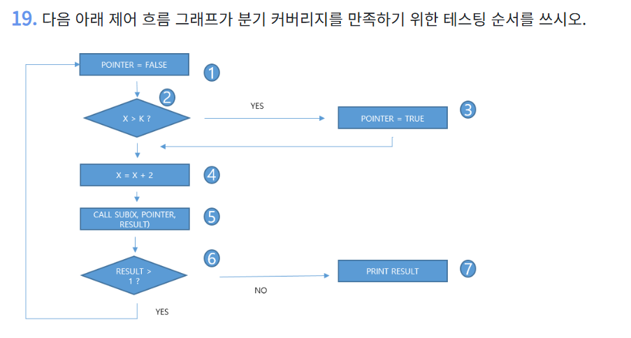
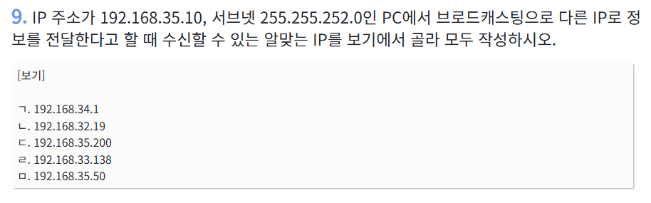
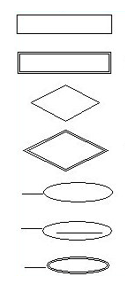
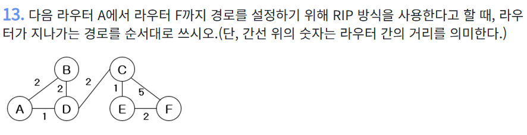

# 🗓️ 2026년 4월 16일 TIL

## 결합도(Coupling)
- 모듈간의 의존성 정도, 낮을수록 좋음


### 결합도(Coupling)의 종류
- 내용, 공통, 외부, 제어, 스탬프, 자료 결합도
- 내공외제스자
- 나쁜 결합, 결합도 높음 ------------------ 좋은 결합, 결합도 낮음


1. 내용 결합도 (Content)
- 최악의 결합
- 한 모듈이 다른 모듈의 내부 코드나 데이터를 직접 수정

2. 공통 결합도 (Common)
- 여러 모듈이 '전역 변수'라는 하나의 공용 데이터를 같이 사용
- 공용 냉장고

3. 외부 결합도 (External)
- 여러 모듈이 외부에 있는 무언가(DB)를 같이 참조
- 외부 파일 형식이 바뀌면 모든 모듈을 수정해야함

4. 제어 결합도 (Control)
- 한 모듈이 다른 모듈에게 흐름을 제어하는 신호를 보내는 경우
- 상위 모듈의 제어 방식이 바뀌면, 하위 모듈도 그에 맞춰 변경해야 함

5. 스탬프 결합도 (Stamp)
- 필요 이상으로 많은 데이터가 담긴 덩어리(자료구조)를
- 통째로 넘겨주는 경우
- 불필요한 의존성 발생
- DTO를 사용하던 것 생각

6. 자료 결합도 (Data)
- 가장 이상적인 결합
- 모듈끼리 데이터를 주고받을 때, 필요한 최소한의 데이터만을
- 매개변수를 통해 주고받는 관계


## 응집도(Cohesion)
- 모듈 '내부'의 이야기
- 모듈의 구성 요소들이 '하나의 목표'를 위해 얼마나 뭉쳐있는가
- 내부의 단결력 의미
- 높을수록 좋음


### 응집도(Cohesion)의 종류
- 우연적, 논리적, 시간적, 절차적, 통신적, 순차적, 기능적 응집도
- 우논시절통순기
- 응집도 낮음 --------------------------------- 응집도 높음


1. 우연적(Coincidental) 응집도
- 최악의 응집도
- 모듈 내의 기능들이 아무런 관련 없이,
- 어쩌다 보니 한 곳에 모여있는 경우

2. 논리적(Logical) 응집도
- '논리적으로' 유사한 성격의 기능들을 한데 묶은 것
- 각 기능은 실제 하는 일이 다름

3. 시간적(Temporal) 응집도
- '특정 시간'에 함께 실행되어야 하는 기능들을 묶은 것
- 실행 시점만 같음, 기능적으로 서로 관련이 없을 수 있음

4. 절차적(Procedural) 응집도
- 기능들이 명확한 순서, '절차'를 가지고 실행될 때
- 순서에 따라 묶은 것
- 기능들의 실행 순서가 매우 중요

5. 통신적(Communicational) 응집도 (= 교환)
- 동일한 입력 데이터를 사용하거나,
- 동일한 출력 데이터를 만들어내는 기능들을 묶은 것
- '게시물 데이터'라는 공통의 관심사를 가지고 통신하므로 밀접한 관계

6. 순차적(Sequential) 응집도
- 절차적 응집도보다 더 끈끈한 관계
- 모듈 내 한 기능의 출력물이,
- 바로 다음 기능의 입력물이 되는,
- 데이터가 물 흐르듯이 흘러가는 구조

7. 기능적(Functional) 응집도
- 최고의 응집도
- 하나의 완벽한 기능만을 수행하기 위해 구성된 상태

---

## 테스트 커버리지 정리 (Branch / Condition / Path)


## 문제 구조 요약

제어 흐름:



### ✔️ 조건 2개

* C1: `X > K`
* C2: `RESULT > 1`

---

# 1️⃣ 분기 커버리지 (Branch Coverage)

## ✔️ 개념

각 조건문의 결과(True / False)를
👉 **최소 1번씩 실행**

---

## ✔️ 이 문제에 적용

### 📌 분기 1

* `X > K` → True / False

### 📌 분기 2

* `RESULT > 1` → True / False

---

## ✔️ 테스트 케이스

### 🔹 테스트 1

```
1 → 2 → 4 → 5 → 6 → 7
(X > K = False, RESULT > 1 = False)
```

### 🔹 테스트 2

```
1 → 2 → 3 → 4 → 5 → 6 → 1
(X > K = True, RESULT > 1 = True)
```

---

## 🎯 핵심

👉 “각 if의 결과만 한 번씩 찍으면 끝”

---

# 2️⃣ 조건 커버리지 (Condition Coverage)

## ✔️ 개념

조건식 내부의 **각 조건이**
👉 True / False를 모두 가지도록 테스트

---

## ✔️ 이 문제에 적용

조건은 이미 단일 조건이라서:

* `X > K` → T / F
* `RESULT > 1` → T / F

👉 분기 커버리지랑 **동일해짐**

---

## ✔️ 테스트 케이스

👉 분기 커버리지와 동일

```
(1 → 2 → 4 → 5 → 6 → 7)
(1 → 2 → 3 → 4 → 5 → 6 → 1)
```

---

## 🎯 핵심

👉 조건이 AND / OR 없으면
👉 **분기 = 조건 커버리지**

---

# 3️⃣ 경로 커버리지 (Path Coverage)

## ✔️ 개념

👉 가능한 모든 실행 경로를 테스트

---

## ✔️ 이 문제에서 가능한 경로

### 🔹 경로 1 (즉시 종료)

```
1 → 2 → 4 → 5 → 6 → 7
```

---

### 🔹 경로 2 (한 번 루프 후 종료)

```
1 → 2 → 3 → 4 → 5 → 6 → 1
→ 2 → 4 → 5 → 6 → 7
```

---

### 🔹 경로 특징

* 루프가 있어서 **무한 경로 가능**
* 그래서 현실적으로는
  👉 **대표 경로만 선택**

---

## 🎯 핵심

👉 “루프 때문에 경로 커버리지는 현실적으로 제한함”

---

# 🔥 최종 비교 (이 문제 기준)

| 구분      | 테스트 수 | 특징           |
| ------- | ----- | ------------ |
| 분기 커버리지 | 2개    | 가장 기본        |
| 조건 커버리지 | 2개    | (단일 조건이라 동일) |
| 경로 커버리지 | 2개 이상 | 루프 때문에 증가    |

---

# 🧠 핵심 정리 (시험용)

### ✅ 1. 강도

```
경로 > 조건 ≥ 분기
```

### ✅ 2. 이 문제 특징

```
조건이 단순 → 분기 = 조건
```

### ✅ 3. 핵심 포인트

👉 루프 있으면 경로 커버리지 = 폭발

---

# 💬 한 줄 요약

👉 “이 문제는 조건이 단순해서 분기 = 조건이고,
경로는 루프 때문에 늘어난다”

---


좋아 👍 이건 개념 하나만 정확히 알면 바로 맞히는 문제야!

---

## IPC (Inter-Process Communication), 프로세스 간 통신

### 개념 설명

- **IPC**는 서로 다른 프로세스들이 데이터를 주고받는 방법

---

## IPC 방식들
* 공유 메모리 (Shared Memory)
* 소켓 (Socket)
* 세마포어 (Semaphore)
* 메시지 큐 (Message Queue)

전부 묶어서 **IPC**

---

## 한 줄 암기

```text
프로세스끼리 대화 = IPC
```

---

## 파이썬 코드

```python
data = [
    [3, 5, 2, 4, 1],
    [4, 5, 1],
    [4, 4, 1, 5, 4],
    [4, 5]
]
 
result = {}
 
for index, lis in enumerate(data):
    list_sum = sum(lis)
    list_len = len(lis)
 
    result[index] = (list_sum, list_len)
 
print(result)
```

## 📌 전체 흐름 한눈에 보기

- “각 리스트마다 → (합, 길이) 계산 → result에 저장”

---

# 1️⃣ 데이터 구조 이해

```python
data = [
    [3, 5, 2, 4, 1],
    [4, 5, 1],
    [4, 4, 1, 5, 4],
    [4, 5]
]
```

- 리스트 안에 리스트가 있는 구조 (2차원 리스트)

---

# 2️⃣ 결과 저장용 딕셔너리

```python
result = {}
```

- 결과를 담을 빈 딕셔너리 생성

---

# 3️⃣ 핵심 반복문

```python
for index, lis in enumerate(data):
```

### 중요

* `enumerate(data)` 👉 (인덱스, 값) 같이 꺼냄

실제 동작:

```text
(0, [3,5,2,4,1])
(1, [4,5,1])
(2, [4,4,1,5,4])
(3, [4,5])
```

---

# 4️⃣ 각 리스트 계산

```python
list_sum = sum(lis)
list_len = len(lis)
```

예를 들어 첫 번째:

* `[3,5,2,4,1]`
* 합 = 15
* 길이 = 5

---

# 5️⃣ 딕셔너리에 저장

```python
result[index] = (list_sum, list_len)
```

구조:

```python
index : (합, 길이)
```

---

# 6️⃣ 최종 결과

```python
print(result)
```

출력 결과:

```python
{
  0: (15, 5),
  1: (10, 3),
  2: (18, 5),
  3: (9, 2)
}
```

---

# 전체 동작 요약

```text
각 리스트 → 합(sum) + 길이(len) 계산 → 딕셔너리에 저장
```

---

# 추가 (리팩토링 버전)

조금 더 파이썬스럽게 쓰면

```python
result = {
    i: (sum(lis), len(lis))
    for i, lis in enumerate(data)
}
```

---

## 서브넷 + 브로드캐스트 범위 계산



---

# 1단계: 서브넷 마스크 해석

주어진 값:

```text
IP: 192.168.35.10
서브넷: 255.255.252.0
```

2진수로 바꾸면
```
255 = 11111111
255 = 11111111
252 = 11111100
0   = 00000000
```
- 255.255.252.0 = **/22**
- 앞에서부터 22비트가 네트워크 영역
- 앞 22비트는 네트워크 (고정)
- 뒤 나머지는 호스트 (변함)

---

# 2단계: 블록 크기 구하기

👉 3번째 옥텟에서 계산

```text
256 - 252 = 4
```

👉 네트워크 단위: **4씩 증가**

---

# 3단계: 네트워크 범위 찾기

IP: **192.168.35.10**

👉 35가 포함된 구간 찾기

```text
0 ~ 3
4 ~ 7
8 ~ 11
...
32 ~ 35 ← 우리가 찾은 구간
```

👉 네트워크 주소:

```text
192.168.32.0
```

👉 브로드캐스트 주소:

```text
192.168.35.255
```

---

# 4단계: 사용 가능한 IP 범위

```text
192.168.32.1 ~ 192.168.35.254
```

---

# 5단계: 보기 판별

### ✔️ 가능한 것 (범위 안)

* ㄱ. 192.168.34.1 ✅
* ㄴ. 192.168.32.19 ✅
* ㄷ. 192.168.35.200 ✅
* ㄹ. 192.168.33.138 ✅
* ㅁ. 192.168.35.50 ✅

👉 전부 범위 안!

---

# ✅ 최종 정답

👉 **ㄱ, ㄴ, ㄷ, ㄹ, ㅁ (전부)**

---

# 시험용 핵심 스킬

👉 /22 나오면 무조건

```text
3번째 옥텟 4단위 끊기
```

👉 32~35 찾으면 끝

---

# 💬 한 줄 요약

👉 “192.168.32 ~ 35 대역이면 다 같은 네트워크라 전부 수신 가능”

---

## SIEM
- 머신러닝 기술을 이용하여 IT 시스템에서 발생하는 대량의 로그를 통합관리 및 분석하여 사전에 위협에 대응하는 보안 솔루션

---

## 테스트 하네스의 구성 요소
- 테스트를 실행하기 위한 환경 + 도구 세트

### 테스트 드라이버 (Test Driver)
- 상향식 테스트에서 하위 모듈부터 테스트
- 완성되지 않은 상위 모듈을 대신하여 테스트 드라이버 사용

### 테스트 스텁 (Test Stub)
- 하향식 테스트에서 상위 모듈부터 테스트
- 완성되지 않은 하위 모듈을 대신하여 테스트 스텁 사용

### 테스트 케이스 (Test Case)
- 입력값 + 기대 결과 정의

### 테스트 결과 (Test Result)
- 실제 실행 결과

---

## E-R 다이어그램 표기 방법


1. 개체 타입
2. 약한 개체 타입
3. 관계 타입
4. 약한 관계 타입
5. 속성
6. 키 속성
7. 다중값 속성

---

## 암호화 알고리즘
- 대칭키: DES, AES, ARIA, SEED
- 비대칭키: RSA, ECC

---

## C언어 포인터 + 연결 리스트 + 비트 연산

### 1️⃣ 구조체 이해

```c
struct Node {
    struct Node* next;
    unsigned int x;
};
```

👉 노드 하나는

* `next` → 다음 노드 주소
* `x` → 값
* `unsigned int x;`: 부호 없는 정수형 변수 선언, 음수 불가능

---

### 2️⃣ 노드 생성

```c
t1 = {0, 5}
t2 = {0, 7}
t3 = {0, 11}
```

---

### 3️⃣ 연결 구조 만들기

```c
t3 → t2 → t1 → NULL
```

👉 실제 연결:

```text
t3(11) → t2(7) → t1(5)
```

---

### 4️⃣ 반복문 실행

```c
while (curr) {
    sum = sum * 3 + curr->x;
    curr = curr->next;
}
```

👉 하나씩 따라가보자

---

### 🔄 1회전 (t3 = 11)

```text
sum = 0 * 3 + 11 = 11
```

---

### 🔄 2회전 (t2 = 7)

```text
sum = 11 * 3 + 7 = 40
```

---

### 🔄 3회전 (t1 = 5)

```text
sum = 40 * 3 + 5 = 125
```

---

### 5️⃣ 마지막 연산

```c
sum = (sum ^ 42u) + 100u;
```

👉 먼저 XOR 계산

---

### XOR (^)

```text
125 ^ 42
```

2진수로 보면:

```text
125 = 01111101
 42 = 00101010
----------------
      01010111 = 87
```

---

## ➕ +100

```text
87 + 100 = 187
```

---

# ✅ 최종 출력

```text
187
```

---

## 병행 제어 기법

```text
로킹        → 잠금으로 제어 (데드락 가능)
타임스탬프  → 시간 순서대로 처리 (데드락 없음)
낙관적      → 마지막에 충돌 검사
다중버전    → 여러 버전 유지 (읽기 빠름)
```
### 로킹 종류
- 공유락 (Shared Lock)  → 읽기만 가능 (여러 개 허용, 같이 읽기 가능)
- 배타락 (Exclusive Lock) → 읽기 + 쓰기 (하나만 허용, 혼자 사용)


---


## 데드락 발생 조건 4가지

```text
상호배제   → 자원은 하나만 사용 가능
점유대기   → 자원 가진 채로 다른 자원 대기
비선점     → 강제로 뺏을 수 없음
환형대기   → 서로 물고 물리는 구조
```

---

## 블랙박스 테스트
- 내부 몰라도 됨 (입력/출력만 확인)

```text
동등분할     → 입력을 그룹으로 나눔
경계값 분석  → 경계 값 집중 테스트
원인-결과 그래프 → 조건 조합 테스트
오류 예측     → 경험 기반 테스트
```

## 화이트박스 테스트
- 내부 코드 보면서 검사 (로직/경로 확인)

```text
구문 커버리지   → 모든 코드 실행
분기 커버리지   → True/False 실행
조건 커버리지   → 조건 각각 검사
경로 커버리지   → 모든 경로 실행
```

---

## SYN Flooding

- TCP는 연결을 수립하기 위해 클라이언트가 서버에
  SYN 패킷을 보내고 서버는 SYN-ACK 패킷으로 응답한 후
  클라이언트가 다시 ACK 패킷을 보내는 3-way-handshake 과정을 거친다.


- 공격자는 클라이언트 역할로 수많은 SYN 패킷을
  서버에 전송한 뒤 마지막 ACK를 고의로 보내지 않아 서버가 연결 대기 상태를 계속 유지하게 만든다.

- 이로 인해 서버의 연결 대기 큐가 가득 차면서 정상적인 접속 요청을 처리하지 못하게 되어 서비스 거부 상태가 발생한다.

---

## 프로토콜을 구성하는 대표적인 세가지 요소

1. 구문
2. 의미
3. 타이밍

---

## 네트워크 경로 계산



RIP(Routing Information Protocol)는 거리 벡터 라우팅 프로토콜 중 하나로, 각 라우터가 이웃 라우터에게 주기적으로 자신의 라우팅 테이블을 전송하여 경로를 학습합니다. RIP는 경로를 계산할 때 홉 수(패킷이 라우터를 통과하는 횟수)를 기준으로 가장 짧은 경로를 선택하며, 최대 홉 수는 15로 제한됩니다. 이때 홉 수가 16 이상이면 해당 경로는 도달할 수 없는 것으로 간주됩니다.

주어진 네트워크에서의 경로 계산 (각 방식별):
1. RIP (Routing Information Protocol) 방식:
   RIP에서는 홉 수만을 고려하여 경로를 선택합니다.

A → F:
A → D → C → F (총 3 홉, 가장 짧음)
A → D → C → E → F (총 4 홉)
2. OSPF (Open Shortest Path First):
   OSPF는 링크 상태 기반으로 경로 비용을 계산하며, 비용은 주로 링크의 대역폭에 기반하여 설정됩니다. 그림에서는 링크에 표시된 숫자(비용)를 이용해 최단 경로를 계산합니다.

A → F:
A → D → C → F (1 + 2 + 5 = 총 8)
A → D → C → E → F (1 + 2 + 1 + 2 = 총 6)
3. EIGRP (Enhanced Interior Gateway Routing Protocol):
   EIGRP는 복합 지표(대역폭, 지연 등)를 기반으로 경로를 선택합니다. 기본적으로 대역폭이 낮고 지연이 적은 경로를 선호하며, 실제로는 비용이 다르게 계산됩니다. 그림에 표시된 숫자를 단순 비용으로 사용하면 OSPF와 동일하게 동작할 가능성이 큽니다.

A → F:
A → D → C → F (1 + 2 + 5 = 총 8)
A → D → C → E → F (1 + 2 + 1 + 2 = 총 6)
4. Static Routing (정적 라우팅):
   정적 라우팅은 관리자가 경로를 직접 설정하므로 네트워크 설계자에 따라 A → F로 가는 경로가 결정됩니다. 경로의 최적화는 설계자의 판단에 따라 달라지며, 비용이 가장 적은 경로로 설정될 가능성이 큽니다.

따라서 비용이 적은 A → D → C → E → F 경로가 정적으로 설정될 가능성이 있습니다.
결론적으로 RIP는 홉 수를 기준으로 A → D → C → F 경로를 선택하고, OSPF, EIGRP 및 Static 라우팅 방식에서는 비용을 고려하여 A → D → C → E → F 경로가 선택됩니다.

---

## 추상 팩토리 패턴

- 구체적인 클래스에 의존하지 않고, 서로 연관되거나 의존적인 객체들의 조합을 만드는 인터페이스를 제공하는 패턴